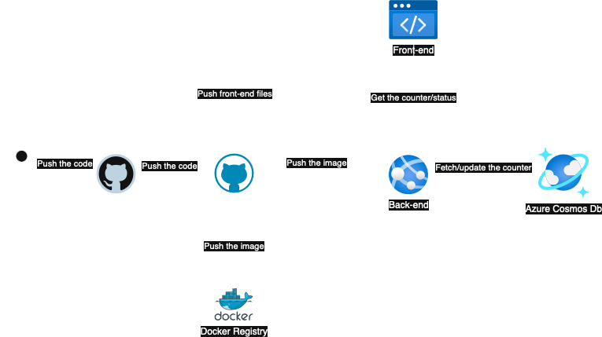

# 🚀 Portfolio with Flask, Azure & Cosmos DB

This project is a **personal portfolio** that demonstrates modern web development, containerization, and cloud deployment skills. It includes a frontend hosted via **Azure Static Web Apps** and a backend built with **Flask**, containerized using Docker, and deployed to **Azure App Service**. The backend integrates with **Azure Cosmos DB** to persist a visit counter.

---

## 🧱 Architecture Overview



### Components

- **Frontend**
  - Static site built with vanilla CSS and HTML
  - Deployed via **Azure Static Web Apps**
  - Integrated with CI/CD (GitHub Actions)

- **Backend**
  - Built with **Python Flask**
  - Exposes a `/counter` API to track site visits
  - Dockerized and deployed to **Azure App Service for Containers**
  - CI/CD via GitHub Actions

- **Database**
  - **Azure Cosmos DB** (SQL API)
  - Stores and increments a `count` field inside the `visite` container

---

## ✨ Features

- `/counter`: Increments and returns the total visit count
- `/health`: Health check endpoint for monitoring
- Infrastructure provisioned via **Terraform**
- CI/CD pipelines for both frontend and backend

---

## 🧪 API Endpoints

| Method | Endpoint     | Description                    |
|--------|--------------|--------------------------------|
| GET    | `/counter`   | Increments and returns counter |
| GET    | `/health`    | Returns application health     |

---

## 🛠️ Local Development

### Backend

```bash
git clone https://github.com/your-username/cloud-portfolio.git
cd backend

# Setup virtual environment
python3 -m venv venv
source venv/bin/activate
pip install -r requirements.txt

# Set environment variables
export COSMOS_URI="your_cosmosdb_uri"
export COSMOS_KEY="your_cosmosdb_key"

# Run the Flask app
python app.py
```

> **Note:** The backend expects a Cosmos DB container with partition key `/id` and a document with `id="main"` to track visits.

---

## 🚀 Deployment

### Infrastructure as Code (Terraform)

```bash
cd terraform
terraform init
terraform plan
terraform apply
```

Resources provisioned:

- Azure Resource Group  
- Static Web App  
- App Service Plan + App Service (Linux Container)  
- Cosmos DB Account + SQL Database + Container

### CI/CD

- GitHub Actions pipeline for **frontend**:
  - Trigger: push to `main`
  - Build + Deploy to Azure Static Web App

- GitHub Actions pipeline for **backend**:
  - Trigger: push to `main`
  - Build multi-arch Docker image (`linux/amd64`, `linux/arm64`)
  - Push to Azure Container Registry
  - Deploy to App Service

---

## 📁 Project Structure

```
cloud-portfolio/
├── backend/             # Flask application
│   ├── app.py
│   ├── requirements.txt
│   └── Dockerfile
├── frontend/            # Static frontend
├── terraform/           # IaC with Terraform
└── .github/workflows/   # CI/CD pipelines
```

---

## 📦 Tech Stack

- Python + Flask
- Docker
- Azure App Service
- Azure Static Web Apps
- Azure Cosmos DB (SQL API)
- Terraform
- GitHub Actions

---

## 💡 Future Improvements

- Add authentication (e.g., Azure AD B2C)
- Implement analytics dashboard
- Add logging & monitoring with Azure Application Insights

---

## 📄 License

This project is open-source and available under the [MIT License](LICENSE).

---

## 👤 Author

**Tommaso Sorrentino**  
[LinkedIn](https://linkedin.com/in/tommaso-sorrentino) · [Email](mailto:t.sorrentino14@studenti.unisa.it)

---

## 🌐 Live Demo

[Visit the Live Portfolio →](https://your-staticwebapp-url.azurestaticapps.net)
